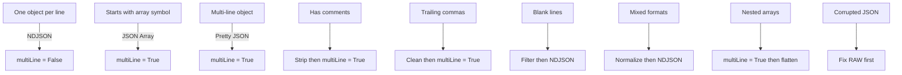
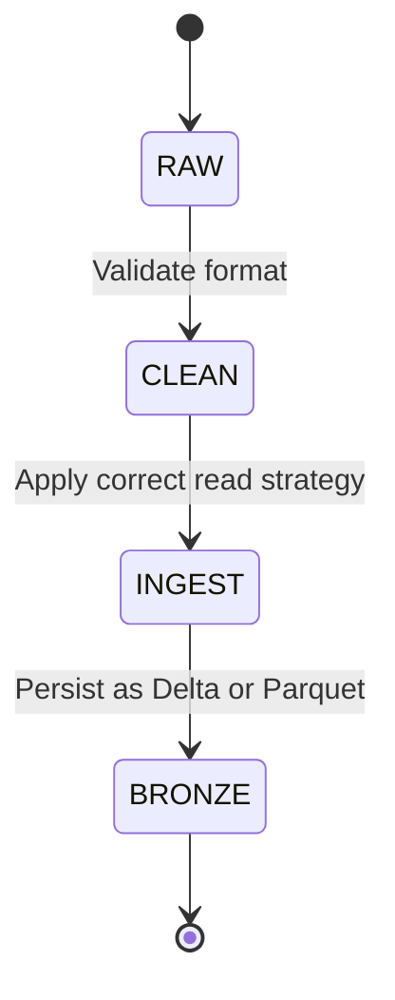
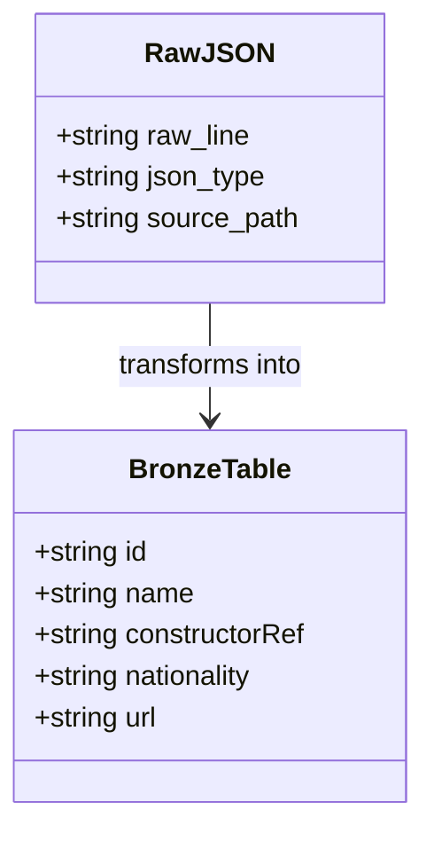
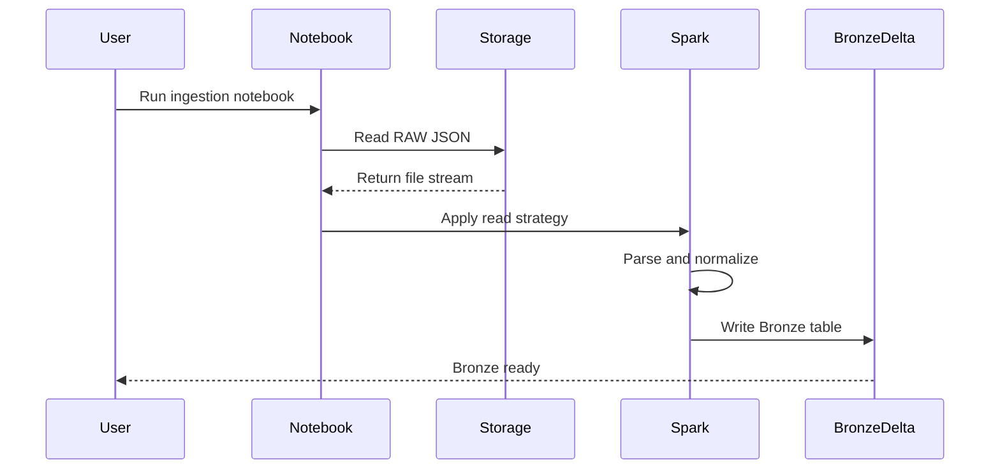

```code
IF file has one JSON object per line → NDJSON → multiLine=False
IF file starts with [ → JSON Array → multiLine=True
IF file spans multiple lines but no [ → Pretty JSON → multiLine=True
IF file has comments → strip → then multiLine=True
IF file has trailing commas → clean → then multiLine=True
IF file has blank lines → filter → then NDJSON
IF file is mixed → normalize → then NDJSON
IF file is nested → multiLine=True → flatten
IF file is corrupted → fix RAW first
This is the entire universe of JSON ingestion patterns for RAW → Bronze.
```








