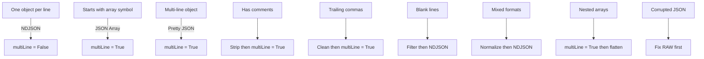

```mermaid
flowchart TD
    A[One object per line] -->|NDJSON| B[multiLine = False]
    C[Starts with array symbol] -->|JSON Array| D[multiLine = True]
    E[Multi-line object] -->|Pretty JSON| F[multiLine = True]
    G[Has comments] --> H[Strip then multiLine = True]
    I[Trailing commas] --> J[Clean then multiLine = True]
    K[Blank lines] --> L[Filter then NDJSON]
    M[Mixed formats] --> N[Normalize then NDJSON]
    O[Nested arrays] --> P[multiLine = True then flatten]
    Q[Corrupted JSON] --> R[Fix RAW first]

```
