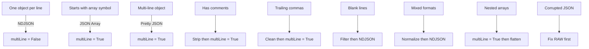
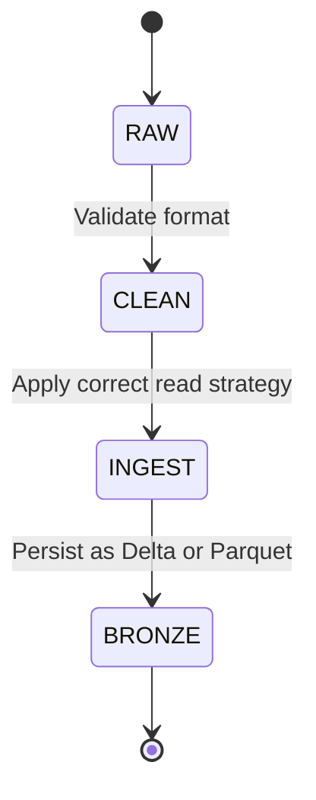
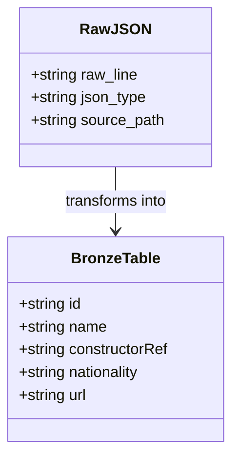
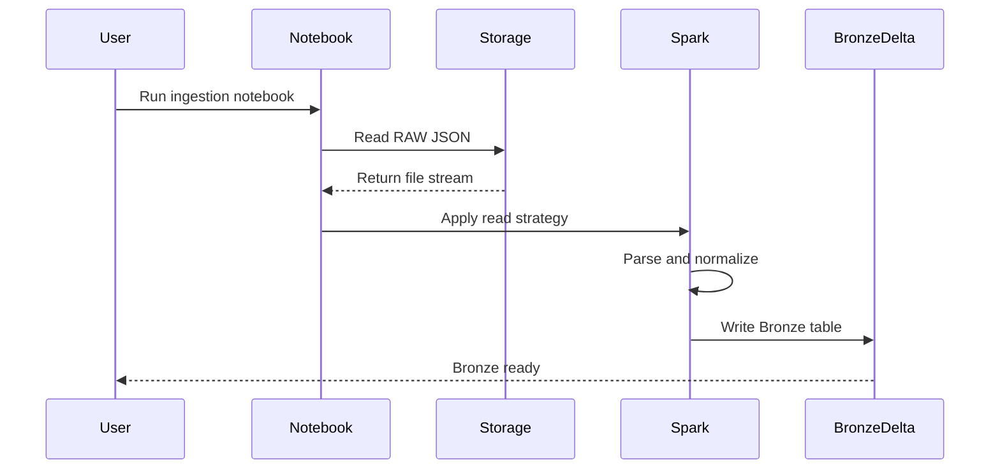

```mermaid
flowchart TD
    A[One object per line] -->|NDJSON| B[multiLine = False]
    C[Starts with array symbol] -->|JSON Array| D[multiLine = True]
    E[Multi-line object] -->|Pretty JSON| F[multiLine = True]
    G[Has comments] --> H[Strip then multiLine = True]
    I[Trailing commas] --> J[Clean then multiLine = True]
    K[Blank lines] --> L[Filter then NDJSON]
    M[Mixed formats] --> N[Normalize then NDJSON]
    O[Nested arrays] --> P[multiLine = True then flatten]
    Q[Corrupted JSON] --> R[Fix RAW first]

```

```mermaid
stateDiagram-v2
    [*] --> RAW
    RAW --> CLEAN : Validate format
    CLEAN --> INGEST : Apply correct read strategy
    INGEST --> BRONZE : Persist as Delta or Parquet
    BRONZE --> [*]
```

```mermaid
classDiagram
    class RawJSON {
        +string raw_line
        +string json_type
        +string source_path
    }

    class BronzeTable {
        +string id
        +string name
        +string constructorRef
        +string nationality
        +string url
    }

    RawJSON --> BronzeTable : transforms into
```

```mermaid
sequenceDiagram
    participant User
    participant Notebook
    participant Storage
    participant Spark
    participant BronzeDelta

    User->>Notebook: Run ingestion notebook
    Notebook->>Storage: Read RAW JSON
    Storage-->>Notebook: Return file stream
    Notebook->>Spark: Apply read strategy
    Spark->>Spark: Parse and normalize
    Spark->>BronzeDelta: Write Bronze table
    BronzeDelta-->>User: Bronze ready
```
